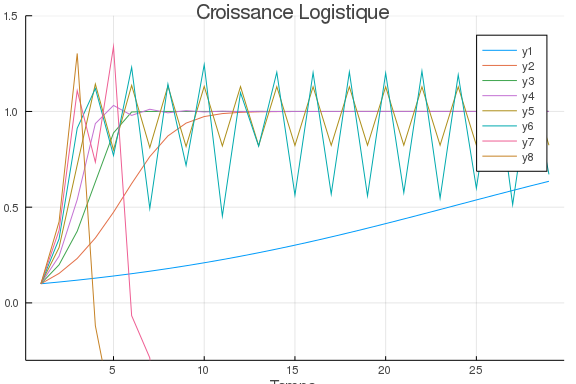
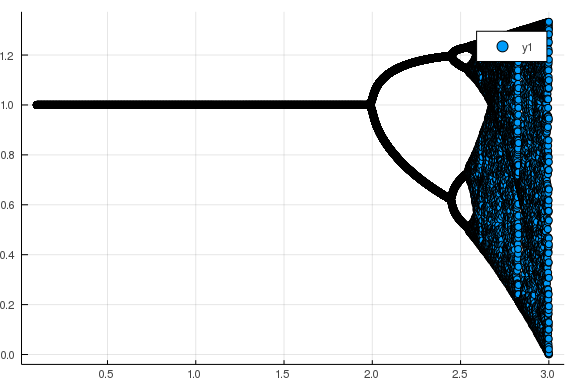

# Introduction

> Allo Starting from the logistic model of growth with competition, you will (i)
> propose an analysis to show how we can find a vaalue of the growth rate *r*
> after which the population cannot persist (this will involve finding the
> maximum of a function, and then iterating this function enough times from this
> maximum), and (ii) plot the bifurcation diagram of the logistic model to show
> that there is indeed a maximal growth rate after which the system becomes
> unstable. Please note that you should not attempt to calculate this value by
> hand, but you may attempt to guess it based on the results of the second step.

Dans le modèle de croissance exponentielle, le taux de croissance par capita reste le même peu importe la taille de population. De ce modèle simpliste, plus la taille de population augmente, plus la population croit rapidement car il y a alors d’avantage d’individus reproducteurs. Il n’y a donc pas de compétition pour les ressources entre individus.

Par contre, dans le modèle de croissance logistique, le taux de croissance par capita finit par diminuer lorsque la population augmente. La taille de population finit normalement pas se stabiliser autour de la capacité de support de la population (K = 1). D’avantages d’individus reproducteurs ne mènent pas necessairement à un taux de croissance plus élevé comme pour le modèle de croissance exponentielle car Il y a compétition entre les individus pour des ressources. Le début d’une courbe de croissance logistique ressemble à celui d’une courbe exponentielle car lorsque la population est de petite taille, il n’y a pas de compétition. 


## Required packages

````julia
using Plots
````


## Model description and justification

<!-- Use this model, it assumes that K = 1, making the system dimensionless -->

$$n(t+1) = n(t) + r\times n(t)\times \left(1-n(t)\right)$$

## Model analysis

### Effet du paramètre r.

Voici huit courbes du modèle logistique avec compétition dont le r varie de 0.1 à 4 par bonds de 0.5

````julia
#Activation de la librairie "Plots"
using Plots
plot()

#Spécifier la formule du modèle et le type de valeurs de n et r
function f(n::Float64, r::Float64)
    return (n + (r * n * (1.0 - n)))
end

#Spécifier la taille de la population de départ et sa gradation
population_size = zeros(Float64, 30)
population_size[1] = 0.1

#Boucle dans laquelle r varie de 0.1 à 4 par bonds de 0.5
for r = 0.1:0.5:4
    for i = 2:length(population_size)
        population_size[i] = f(population_size[i-1], r)
    end
    #Tracer les valeurs provenant de la boucle
    plot!(population_size[1:29], ylim=(-0.3, 1.5),
    title = "Croissance Logistique", xlab="Temps", ylab="Taille population")
end
plot!()
````





## Simulations


### Question i) Conditions où le modèle ne peut se maintenir

> propose an analysis to show how we can find a vaalue of the growth rate *r*
> after which the population cannot persist (this will involve finding the maximum
> of a function, and then iterating this function enough times from this  maximum)

Le code renvoie la valeur de R la plus basse pour laquelle la population ne peut se maintenant. 
C'est-à-dire la valeur de R pour laquelle l'interval d'oscillation contient des valeurs de taille population négatives.
Biologiquement, des valeurs de taille de population négatives sont impossible et cela indique que la population s'est éteinte
et n'a pas pu se maintenir dans le temps.

````julia
#Activation de la librairie "Printf"
using Printf

#Spécifier la formule du modèle et le type de valeurs de n et r4)
function f(n::Float64, r::Float64)
    return (n + (r * n * (1.0 - n)))
end

#Spécifier la taille de la population de départ et sa gradation
population_size = zeros(Float64, 30)
population_size[1] = 0.1

#Un tableau de une place avec un Boolean qui est faux par défaut
check = zeros(Bool, 1)

#Boucle dans laquelle r varie de 0.1 à 6 par bonds de 0.000001
for r = 0.1:0.00001:6
    for i = 2:length(population_size)
        population_size[i] = f(population_size[i-1], r)
        #Conditions: la taille de population doit être négative et bool à Faux
        if population_size[i] < 0 && check[1] == false
            #Renvoi le premier r satisfesant les conditions
            println(r)
            #Change la valeur du bool à true pour arrêter la boucle
            check[1] = true
        end
    end
end
````


````
3.00012
````


### Question ii) Diagramme de bifurcation du modèle logistique

> plot the bifurcation diagram of the logistic model to show that there is 
> indeed a maximal growth rate  after which the system becomes unstable. 


-We iterate the recursion equation (Notre equation qu’on a tjrs utilisé) pour un grand nombre de génération (200+) jusqu’a ce que la dynanique approche un poit d’équilibre, un cycle or démontre aucune tendance vers la stabilité.
*Population de départ pour tous à 0.1
*K pour tous à 1
-On prend les derniers 20 points: Plot their values on the vertical axis.

````julia
rs = LinRange(0.1, 3.0, 2901)
T = 200

#T: Nombre diteration
N = zeros(Float64, (T, length(rs)))
function f(n::Float64, r::Float64)
    return (n + (r * n * (1.0 - n)))
end

#Logmod=logistic model, c'est sa fonction. a changer pour logisticGrowth
#le i c'est l'index du tableau rs.
#le r c'est la valeur associée à cet index dans le tableau
for (i,r) in enumerate(rs)
    N[1,i] = 0.1
    for t in 2:T
        #Trouve la valeur avec l'équation logistique pour chaque temps(t) avec la valeur de r associée
        N[t,i] = f(N[t-1,i], r)
    end
end
#Dans les valeurs d'avant, pogne les 20 dernieres pour tt les valeurs de r
F = N[end-19:end,:]
#repete les valeurs de r mais juste les 20 dernieres
R = repeat(rs, inner=20)
#vec prend la matrice a deux places (F) et la met sur 1 array
points = vec(F)

using Plots
plot()
scatter(R, points)
````





R < 2 : Les 20 derniers points sont proche de K
r = 2+ : Pop cycle entre 2 valeurs
r=2.45 : Next period doubling event


